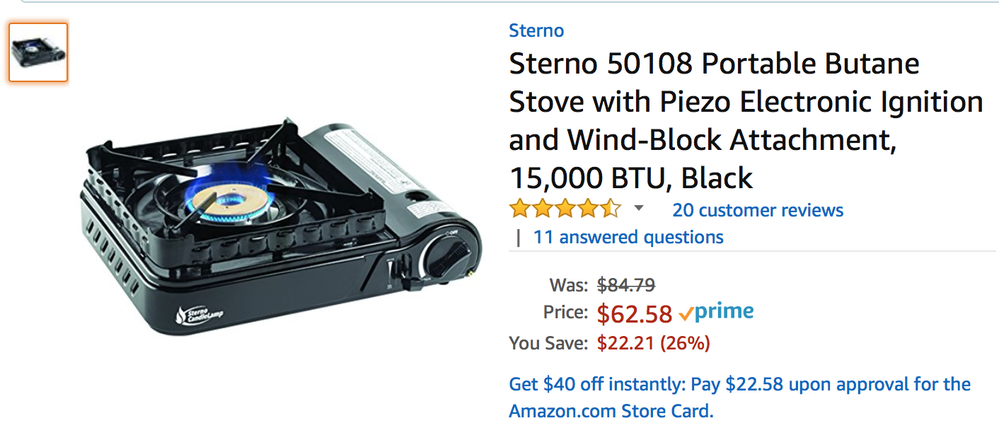
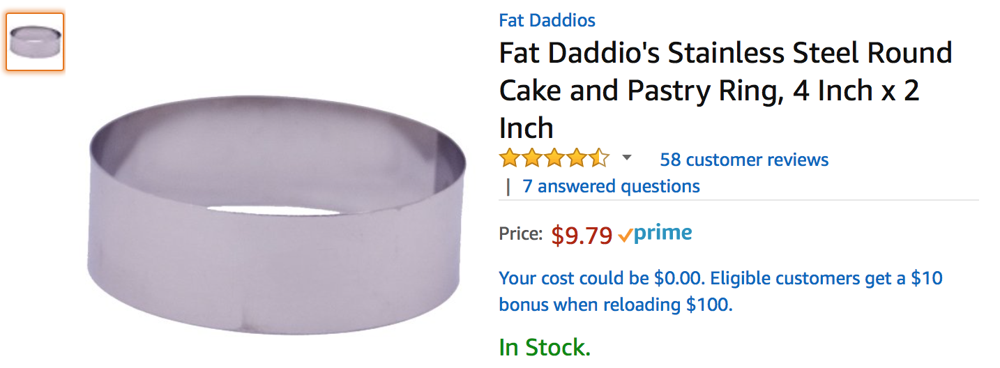
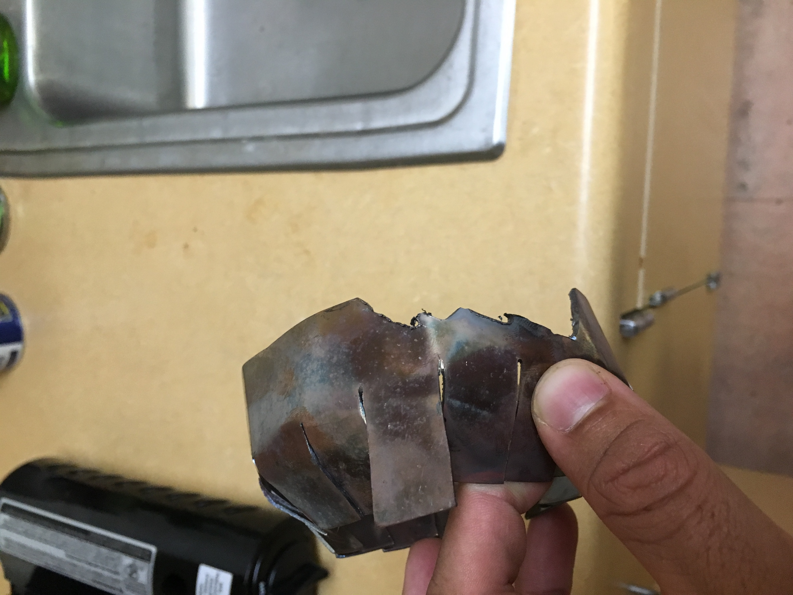

# Portable Gas Stove Modification by Ryan Gibbs

This write-up documents the steps that I took to modify a portable gas stove for use with a wok.

## Motivation

First, I will motivate the project. The electric stoves in Sontag are not designed to accommodate wok cooking’s need for high heat. A round bottom will only make limited contact and there is no open flame to vaporize oil as you toss your food. This problem can be solved by purchasing a portable gas stove. We then run into another problem. Western style gas stoves typically burn using a ring; the heat is directed away from the center, forming a circular “ring” of flame. When we place a curved wok over this style of flame, the majority of the heat “rolls” off of the sides, causing inefficient heating of the surface. To solve this, we can attempt to focus the flames into the center, such that we get maximum absorption, while avoiding that roll off. There is also the issue of a round bottom wok being incompatible with the flat surface of the generic stove. To summarize the requirements of the system:

Open flame to vaporize oils as you toss foods; provides characteristic smoky flavor
Must focus the flames towards the center of the wok to avoid heat roll off
Must be able to balance the wok without the use of hands

To ensure you can vaporize oils, we want to have a stove with a high heat output. This is measured in BTUs. The maximum portable burner strength that I found was 15,000 BTUs. Higher BTU stoves are available, but they are not compact in size and designed for outdoor use. I ended up going with a Sterno 50108 Portable Butane Stove.

This stove uses a dual ring design; there is a smaller flame ring that is inside of a larger flame ring. This provides more even heating over the cooking surface. It was not necessary for this project, but nice to have for general use.

To support the wok and focus the flame, I then purchased two stainless steel pastry rings. To determine sizing, I measured inner ring and gave it half an inch clearance on each side. The second pastry ring was sized by looking at the metal cooking grate on the stove. As long as you choose a ring that fits on the grate, it should be fine.

## Modifications

Modifications were then done, pictured below. I cut a series of lines around the diameter of the 4 inch steel ring, about halfway down its height. The panels that were formed were folded towards the center, creating a type of nozzle. Later, I realized the air flow was insufficient for complete combustion, so I cut air supply holes round the bottom.

Two of the panels are upright so they catch on the metal cooking grate; this causes the nozzle to remain static as I cook.

Next, I had to modify the larger ring for the wok to sit on. This ring has to stay still as I cook; I toss the pan around vigorously, if the ring is loosely attached, it can fall off and burn things. To avoid this, I started off by setting the ring on top of the grate. I then marked where the ring touched the grate. Keep in mind I did this with the thicker side, which I believed would mate with the grate better. After marking the grate, I cut notches into both the ring, and the grate. The fit is shown below.

I also cut flaps in this ring to provide flame outlets. When it was previously sealed, the flame was forced out of the bottom. After making these cuts, the grate and ring should fit together tightly, but it should still be removable with a little effort. After all of these modifications are made, we are ready to fire up the stove after we get some butane.

## Final Result

Here is the results from the finished product.

As you can see it has a high, focused flame, that is capable of reaching up and touching tossed foods. The gaps caused by the two standing flaps caused some leakage, but I am happy as it is. For extra safety during operation, I purchased some insulating material to wrap the butane canister; the focused heat may cause the bay to heat up more, so this is just an added layer of protection.

Thanks for reading my project write-up, hopefully it inspires some of you to cook something delicious!
