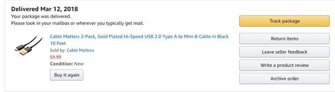
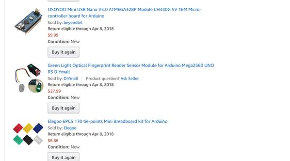
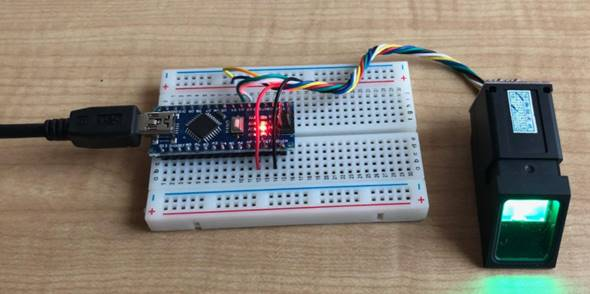
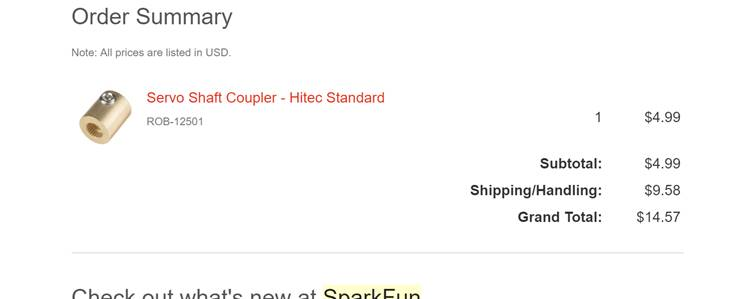
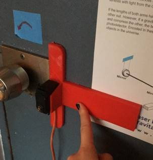
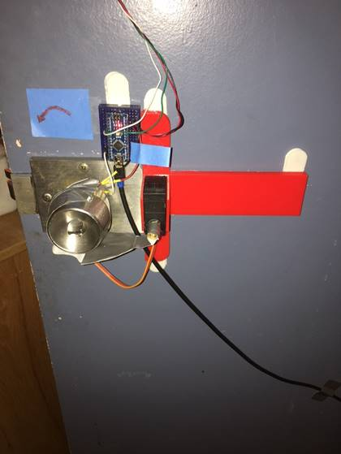

I usually leave my room door slightly ajar because I can never find my key and am always carrying things when I walk up to my door. However, after my longboard got stolen from outside my room I decided this wasn’t such a good idea. The obvious solution for opening my door was to install a biometric lock system. After consulting with Darian Joso and Christopher McElroy (who have done similar projects) I purchased the following materials:

 
 
 

I wired the fingerprint sensor to the OSOYOO nano like so:
(picture from another person on amazon)

 

There’s an Adafruit library online with code that can be used to run the scanner. I also bought the following attachment for the servo motor gear:

 

Yes, unfortunately the shipping was 2x the cost of the part. After all that, it didn’t even fit the gear of the servo like it was supposed to. I ended up supergluing it on there. This part was key for getting a shaft coupled to the motor that could be taped to the doorknob.

I merged the adafruit fingerprint code with some servo starter code (I’d be happy to send this to anyone) and uploaded it to the board. The nice thing about using a servo motor is that it can be powered from the “Arduino” board and doesn’t need extra power.

The hardest part was probably mounting the servo to the door in a way that was temporary but sturdy. I tried several things that didn’t work. Eventually, I broke down a 3D printed a mount:

 

This worked really well with command strips. The whole setup plugs into the wall via a single usb plug. Here is a picture of the finished product:
 

The finger print is mounted to the outside of the door via a command strip and the wires just go around the door.

 

