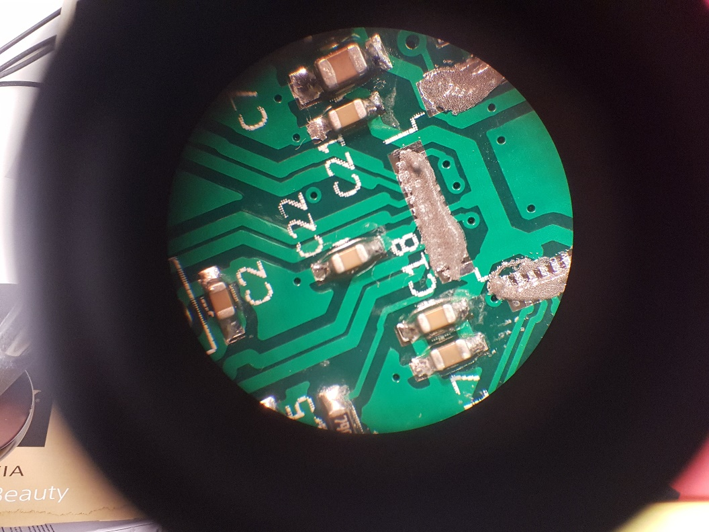
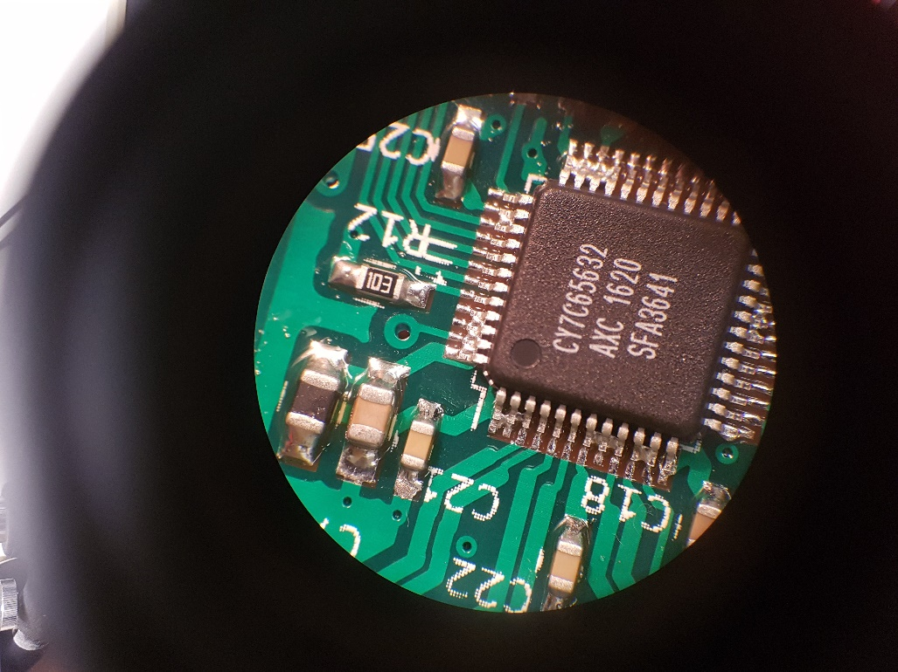
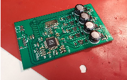

# Cute Compute Cluster

Kalani Duran, Adam Grobman, Katharine Larsen, Kaveh Pezeshki

## Overview:

Using the PCB files given in the Hackaday project [terrible cluster](https://hackaday.io/project/27142-terrible-cluster), our team built a five-node Raspberry Pi Zero cluster on a custom backplane.

## Motivation:

The goal of this project was to provide the team with a simple physical distributed computing platform for education: we wanted experience writing algorithms that can take advantage of multiple cores over a (very) slow interconnect. Additionally, it provided experience with surface-mount soldering, as the board included tight-pitch QFP ICs as well as many 0402 capacitors and resistors.

## Assembly Process:

The PCBs were populated on an SMD rework station, complete with a hot air gun, microscope, and solder paste. We began by populating the PCB with 0402 passive components:

We next needed to solder the USB controller IC, via ample solder paste across the pads, hot air reflow, and finally a solder wick to remove bridges across pins. Some images of the assembly can be seen below:

After all surface mount devices had been added to the board, we then soldered the through-hole components:

The vertical USB headers were particularly difficult. Alignment was crucial in creating an attractive product, but the through-hole header pins were short and fragile. Our solution was to tape the headers in place prior to soldering.

At this point, the PCB was complete, and the Raspberry Pi Zeroes could be added. A Raspberry Pi Zero W serves as the head node, with Wifi as an external interface. The PCB successfully provided power and data communication between the five nodes:

