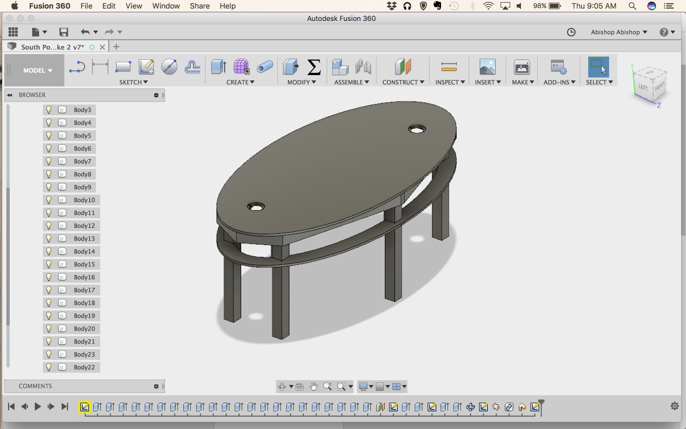

# South Slapcup Table by Andrew Bishop, Elizabeth Poss and Nancy Wei

Many games played around tables at South involve students in standing in a circle. This is a problem because all of the tables have corners, and players at the corner are usually at a disadvantage. In designing this table, eliminating corners became the primary concern. I drew up some plans in Fusion 360, seen below.

Originally, I planned on making the top out of boards laminated together. This would limit the warping and delamination from a plywood top. After spending months trying to get this lamination to work, I gave up and bought a plywood sheet. The boards I was using were too warped to laminate easily and kept splitting apart.

Once I was using the plywood, it was simple to cut out the ellipse on the ShopBot. The frame was all 2x4, and the legs were 4x4. These were also all cut in the machine shop. I notched the legs so the frame rested on them, and drilled holes for bolts so they could be removed and reattached for easy storage.

I painted the top with help from Nancy Wei using exterior paint from Lowe's. The top is a star map of both northern and southern hemispheres. Then I sprayed a waterproof coating over it. This coating ended up altering the surface texture significantly, almost as much as delaminating would have. So in the end, it may not have been worth it.

